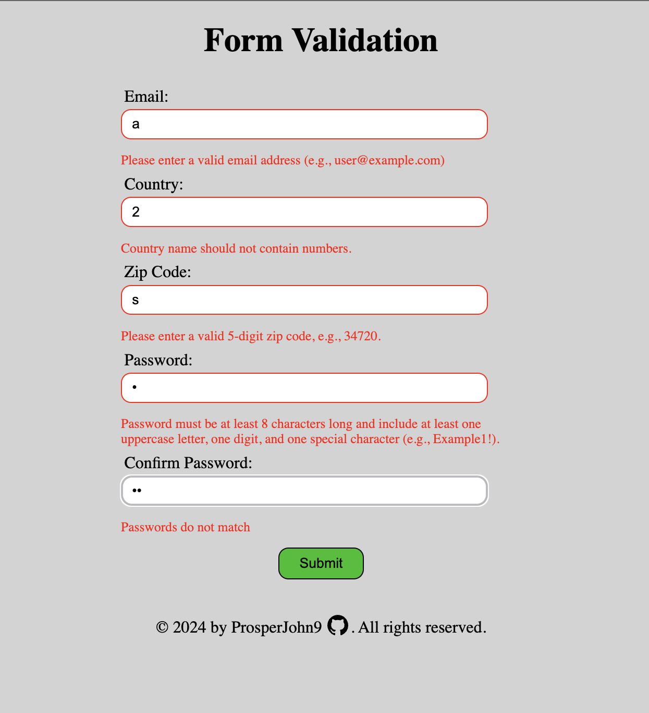
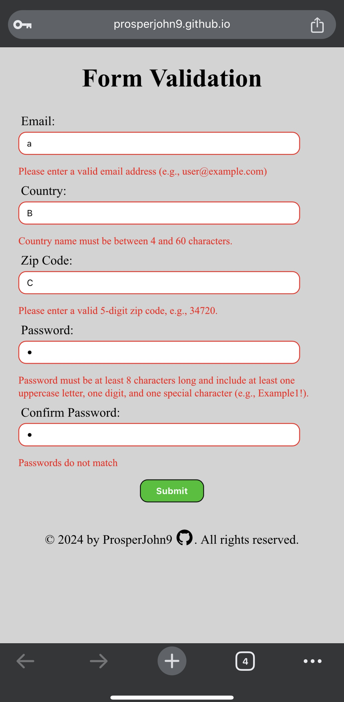

# Form Validation

Live demo:
https://prosperjohn9.github.io/form_validation

Desktop View:

Mobile View:

## Description

This project is about validating forms using the constraint validation API. It includes validation for email, country, zip code, and password fields. This project was created for the [Form Validation with JavaScript](https://www.theodinproject.com/lessons/node-path-javascript-form-validation-with-javascript) assignment as part of The Odin Project curriculum. I met all the assignment objectives and then expanded on it with my own concepts to make it more functional and user-friendly.

## Usage

This project is a form validation example. It includes the following fields:

- Email: Must be a valid email address (e.g., user@example.com)
- Country: The name should not contain numbers and must be between 4 and 60 characters
- Zip Code: Must be a valid 5-digit zip code (e.g., 34720)
- Password: Must meet certain criteria (e.g., include at least one uppercase letter, one number, and one special character)

## Files

- [`index.html`](index.html): Contains the HTML structure of the form
- [`style.css`](style.css): Contains the CSS styles for the form
- [`script.js`](script.js): Contains the JavaScript code for form validation
